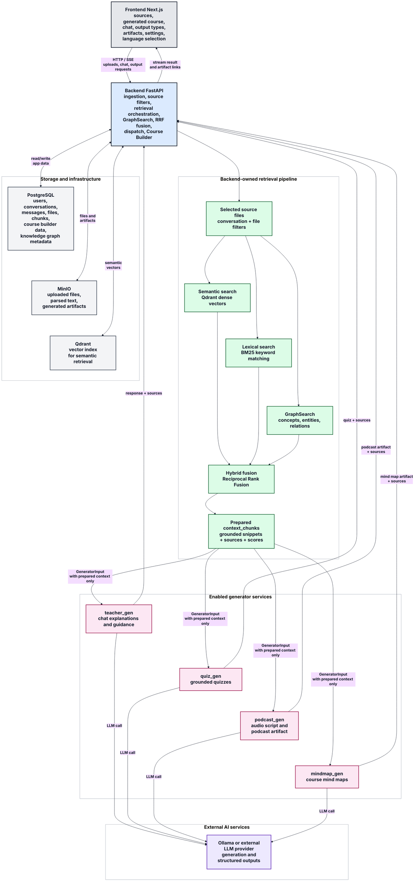
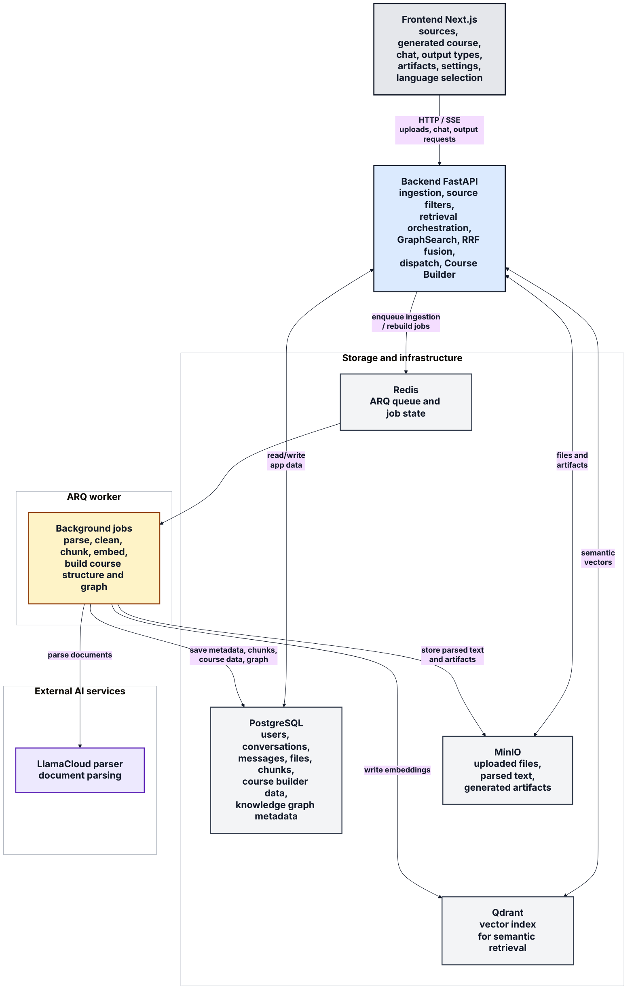

# TeacherLM Architecture Flow - Split

## Part 1 of 2 - Runtime Retrieval and Generation

```mermaid
%%{init: {
  "theme": "base",
  "themeCSS": ".nodeLabel, .edgeLabel, .label, .cluster-label { font-size: 21px !important; font-weight: 700 !important; line-height: 1.25 !important; } .edgeLabel { font-size: 17px !important; } .cluster-label { font-size: 24px !important; font-weight: 800 !important; } .node rect, .node polygon, .node circle { stroke-width: 2.5px !important; }",
  "themeVariables": {
    "fontFamily": "Inter, Arial",
    "fontSize": "21px",
    "primaryTextColor": "#111827",
    "lineColor": "#111827",
    "clusterBkg": "#ffffff",
    "clusterBorder": "#9ca3af"
  },
  "flowchart": {
    "htmlLabels": true,
    "nodeSpacing": 35,
    "rankSpacing": 95,
    "padding": 24
  }
}}%%

flowchart TB

  FE["Frontend Next.js<br/>sources, generated course,<br/>chat, output types,<br/>artifacts, settings,<br/>language selection"]

  BE["Backend FastAPI<br/>ingestion, source filters,<br/>retrieval orchestration,<br/>GraphSearch, RRF fusion,<br/>dispatch, Course Builder"]

  subgraph Retrieval["Backend-owned retrieval pipeline"]
    direction TB
    SF["Selected source files<br/>conversation + file filters"]
    SEM["Semantic search<br/>Qdrant dense vectors"]
    LEX["Lexical search<br/>BM25 keyword matching"]
    GRAPH["GraphSearch<br/>concepts, entities, relations"]
    RRF["Hybrid fusion<br/>Reciprocal Rank Fusion"]
    CTX["Prepared context_chunks<br/>grounded snippets + sources + scores"]
  end

  subgraph Data["Storage and infrastructure"]
    direction TB
    PG["PostgreSQL<br/>users, conversations,<br/>messages, files, chunks,<br/>course builder data,<br/>knowledge graph metadata"]
    MINIO["MinIO<br/>uploaded files,<br/>parsed text,<br/>generated artifacts"]
    QDRANT["Qdrant<br/>vector index<br/>for semantic retrieval"]
  end

  subgraph External["External AI services"]
    direction TB
    LLM["Ollama or external<br/>LLM provider<br/>generation and<br/>structured outputs"]
  end

  subgraph Generators["Enabled generator services"]
    direction TB
    TEACHER["teacher_gen<br/>chat explanations and guidance"]
    QUIZ["quiz_gen<br/>grounded quizzes"]
    PODCAST["podcast_gen<br/>audio script and<br/>podcast artifact"]
    MINDMAP["mindmap_gen<br/>course mind maps"]
  end

  FE -->|"HTTP / SSE<br/>uploads, chat, output requests"| BE

  BE --> SF
  SF --> SEM
  SF --> LEX
  SF --> GRAPH
  SEM --> RRF
  LEX --> RRF
  GRAPH --> RRF
  RRF --> CTX

  SF ~~~ SEM
  SEM ~~~ LEX
  LEX ~~~ GRAPH
  GRAPH ~~~ RRF
  RRF ~~~ CTX

  PG ~~~ MINIO
  MINIO ~~~ QDRANT

  TEACHER ~~~ QUIZ
  QUIZ ~~~ PODCAST
  PODCAST ~~~ MINDMAP

  BE <-->|"read/write<br/>app data"| PG
  BE <-->|"files and<br/>artifacts"| MINIO
  BE <-->|"semantic<br/>vectors"| QDRANT

  CTX -->|"GeneratorInput<br/>with prepared context only"| TEACHER
  CTX -->|"GeneratorInput<br/>with prepared context only"| QUIZ
  CTX -->|"GeneratorInput<br/>with prepared context only"| PODCAST
  CTX -->|"GeneratorInput<br/>with prepared context only"| MINDMAP

  TEACHER -->|"LLM call"| LLM
  QUIZ -->|"LLM call"| LLM
  PODCAST -->|"LLM call"| LLM
  MINDMAP -->|"LLM call"| LLM

  TEACHER -->|"response + sources"| BE
  QUIZ -->|"quiz + sources"| BE
  PODCAST -->|"podcast artifact<br/>+ sources"| BE
  MINDMAP -->|"mind map artifact<br/>+ sources"| BE

  BE -->|"stream result<br/>and artifact links"| FE

  classDef frontend fill:#e5e7eb,stroke:#111827,stroke-width:2.5px,color:#111827;
  classDef backend fill:#dbeafe,stroke:#111827,stroke-width:2.5px,color:#111827;
  classDef retrieval fill:#dcfce7,stroke:#166534,stroke-width:2.2px,color:#111827;
  classDef data fill:#f3f4f6,stroke:#374151,stroke-width:2.2px,color:#111827;
  classDef external fill:#ede9fe,stroke:#5b21b6,stroke-width:2.2px,color:#111827;
  classDef generator fill:#fce7f3,stroke:#9d174d,stroke-width:2.2px,color:#111827;

  class FE frontend;
  class BE backend;
  class SF,SEM,LEX,GRAPH,RRF,CTX retrieval;
  class PG,MINIO,QDRANT data;
  class LLM external;
  class TEACHER,QUIZ,PODCAST,MINDMAP generator;
```

## Part 2 of 2 - Ingestion Jobs, Storage, and Parsing

```mermaid
%%{init: {
  "theme": "base",
  "themeCSS": ".nodeLabel, .edgeLabel, .label, .cluster-label { font-size: 21px !important; font-weight: 700 !important; line-height: 1.25 !important; } .edgeLabel { font-size: 17px !important; } .cluster-label { font-size: 24px !important; font-weight: 800 !important; } .node rect, .node polygon, .node circle { stroke-width: 2.5px !important; }",
  "themeVariables": {
    "fontFamily": "Inter, Arial",
    "fontSize": "21px",
    "primaryTextColor": "#111827",
    "lineColor": "#111827",
    "clusterBkg": "#ffffff",
    "clusterBorder": "#9ca3af"
  },
  "flowchart": {
    "htmlLabels": true,
    "nodeSpacing": 35,
    "rankSpacing": 95,
    "padding": 24
  }
}}%%

flowchart TB

  FE["Frontend Next.js<br/>sources, generated course,<br/>chat, output types,<br/>artifacts, settings,<br/>language selection"]

  BE["Backend FastAPI<br/>ingestion, source filters,<br/>retrieval orchestration,<br/>GraphSearch, RRF fusion,<br/>dispatch, Course Builder"]

  subgraph Worker["ARQ worker"]
    direction TB
    JOB["Background jobs<br/>parse, clean, chunk, embed,<br/>build course structure and graph"]
  end

  subgraph Data["Storage and infrastructure"]
    direction TB
    PG["PostgreSQL<br/>users, conversations,<br/>messages, files, chunks,<br/>course builder data,<br/>knowledge graph metadata"]
    REDIS["Redis<br/>ARQ queue and job state"]
    MINIO["MinIO<br/>uploaded files,<br/>parsed text,<br/>generated artifacts"]
    QDRANT["Qdrant<br/>vector index<br/>for semantic retrieval"]
  end

  subgraph External["External AI services"]
    direction TB
    LLAMA["LlamaCloud parser<br/>document parsing"]
  end

  FE -->|"HTTP / SSE<br/>uploads, chat, output requests"| BE

  BE -->|"enqueue ingestion<br/>/ rebuild jobs"| REDIS
  REDIS --> JOB
  JOB -->|"parse documents"| LLAMA
  JOB -->|"store parsed text<br/>and artifacts"| MINIO
  JOB -->|"save metadata, chunks,<br/>course data, graph"| PG
  JOB -->|"write embeddings"| QDRANT

  PG ~~~ REDIS
  REDIS ~~~ MINIO
  MINIO ~~~ QDRANT

  BE <-->|"read/write<br/>app data"| PG
  BE <-->|"files and<br/>artifacts"| MINIO
  BE <-->|"semantic<br/>vectors"| QDRANT

  classDef frontend fill:#e5e7eb,stroke:#111827,stroke-width:2.5px,color:#111827;
  classDef backend fill:#dbeafe,stroke:#111827,stroke-width:2.5px,color:#111827;
  classDef worker fill:#fef3c7,stroke:#92400e,stroke-width:2.2px,color:#111827;
  classDef data fill:#f3f4f6,stroke:#374151,stroke-width:2.2px,color:#111827;
  classDef external fill:#ede9fe,stroke:#5b21b6,stroke-width:2.2px,color:#111827;

  class FE frontend;
  class BE backend;
  class JOB worker;
  class PG,REDIS,MINIO,QDRANT data;
  class LLAMA external;
```
