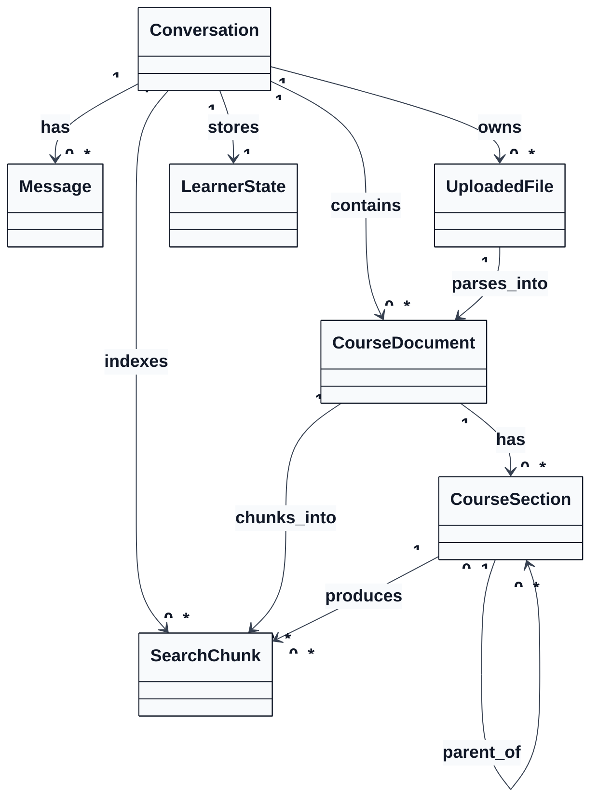
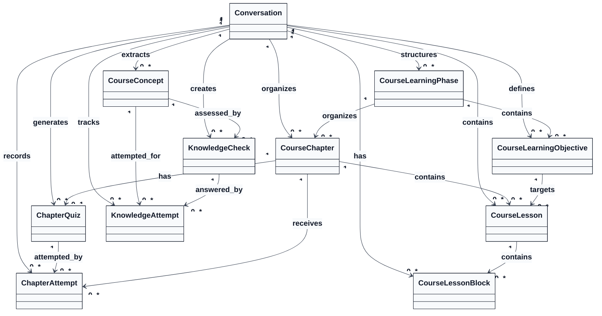
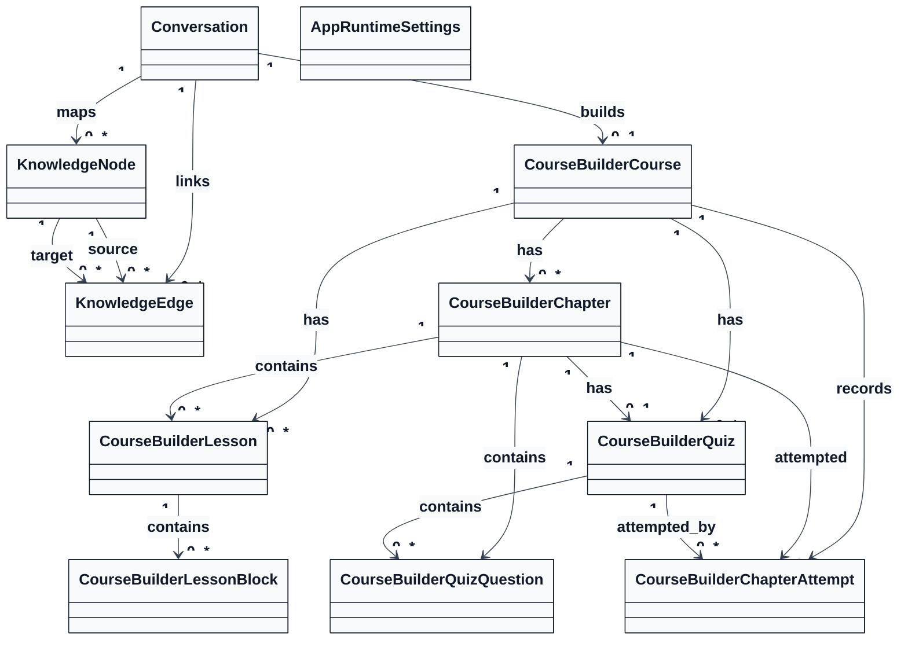

# TeacherLM Class Diagram - 3 A4 Pages

## Page 1 of 3 - Conversation, Files, Documents, Sections, Chunks

## Page 2 of 3 - Learning Path, Lessons, Quizzes, Knowledge Checks

## Page 3 of 3 - Knowledge Graph, Course Builder, Runtime Settings

